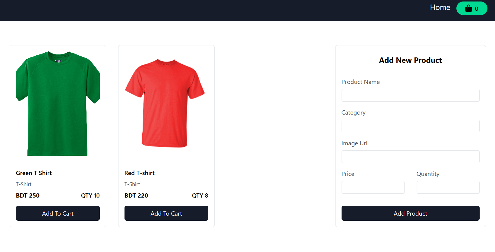
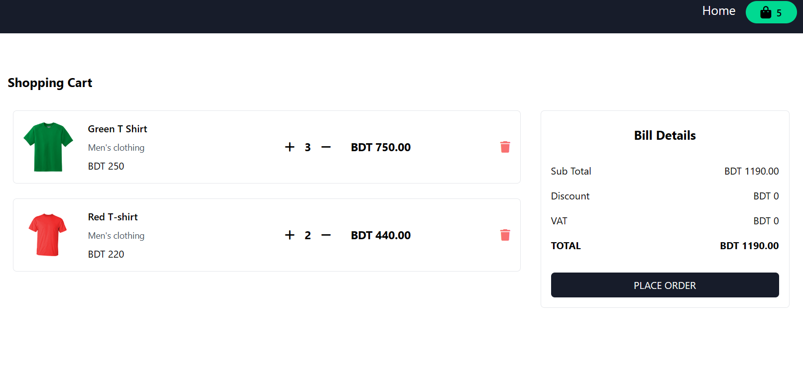

## Product Cart Application State Management Using React-redux

### Live Preview [Show the Live Preview](https://lws-productcart.netlify.app/)

### Functionality

✓ Initially State এ কোনো কিছু থাকবে না। আমরা প্রথমবার যখন সাইটে ঢুকি তখন যেন কোনো প্রোডাক্ট না দেখা যায় এবং একদম ফাঁকা থাকে, If initial state is empty then "No product shown" will be displayed

✓ Template এর ডান পাশে যেই "Add New Product” সেকশনটি রয়েছে, সেখানে প্রোডাক্ট এর তথ্য দিয়ে, "Add Product” বাটনে ক্লিক করলে, সেটি Redux Store এ সেভ হবে এবং Store থেকে ডাটা নিয়ে প্রোডাক্ট টি বাম পাশে Product এর গ্রিড ভিউ তে দেখাতে হবে।
নোটঃ Unsplash বা Pexels এর মত সাইট গুলো থেকে প্রোডাক্ট এর ছবির লিংক নিয়ে, "Image URL” এ বসালে সেই লিংক থেকে ছবি লোড হবে।

✓ Product Add করার সময়, "Quantity” যা দেয়া হবে, তার থেকে বেশি পরিমান এর প্রোডাক্ট Cart এ নেয়া যাবে না। Quantity তে যেই সংখ্যা দেয়া হয়েছিল, সেই পরিমান এর প্রোডাক্ট Cart এ এড হওয়ার সাথে সাথে "Add to Cart” বাটন টি Disable হয়ে যাবে।

✓ প্রতিবার "Add to Cart” এ ক্লিক দেবার সাথে সাথে ঐ Product এর Quantity কমতে থাকবে।

✓ উপরে ডান পাশে, সবুজ Cart আইকনে দেখা যাবে কত গুলো Product Cart এ add হয়েছে। একই Product 10 বার cart এ নিলে, সবুজ Cart আইকনে 10 দেখাবে।

✓ সবুজ Cart আইকনে ক্লিক করলে অন্য একটি পেজে নিয়ে যাবে, সেখানে Cart এ থাকা Product গুলোর লিস্ট দেখাবে এবং ডান এ থাকবে বিলের Details। এবং Home মেনুতে ক্লিক করলে, Home পেজ দেখাবে।

✓ প্রত্যেকটি আইটেমের সাথে একটি কাউন্টার থাকবে যেখানে Plus এবং Minus এ ক্লিক করে কত গুলো প্রোডাক্ট অর্থাৎ Quantity পরিবর্তন করতে পারবে।

✓ প্রতিটি product এর ক্ষেত্রে Quantity এর সাথে Product Price গুন হয়ে প্রতিটি product এর মোট price দেখাবে।

✓ Delete বাটনে ক্লিক করে Product টি সম্পুর্ণ ভাবে Cart থেকে বাদ দিতে পারবেন।
নোটঃ এই কার্ট পেজেও, প্রোডাক্ট এর stock এর থেকে বেশি Quantity এর প্রোডাক্ট কার্টে নেয়া যাবে না।

✓ বাম পাশে যখন Plus/Minus করে প্রোডাক্ট বাড়ানো কিংবা কমানো হবে, তখন ডান পাশের "Bill Details" এও Sub Total এবং Total এ সঠিক হিসাব হয়ে দাম দেখাতে হবে। Here Discount and VAT are shown for dummy perpuoses and not included in the calculation.

### UI for this project

#### Home page

#### Cart page

